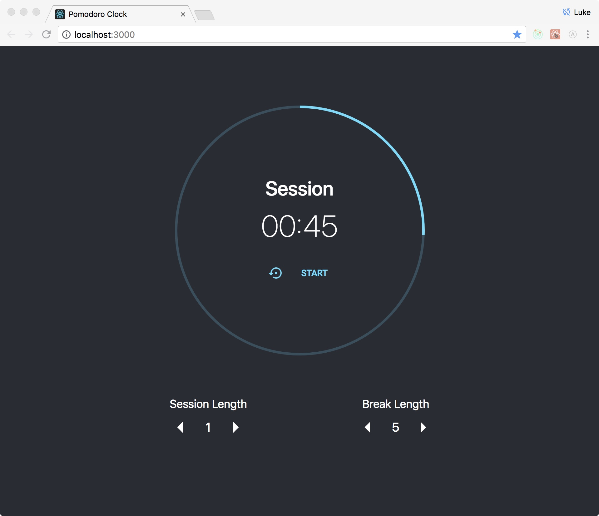
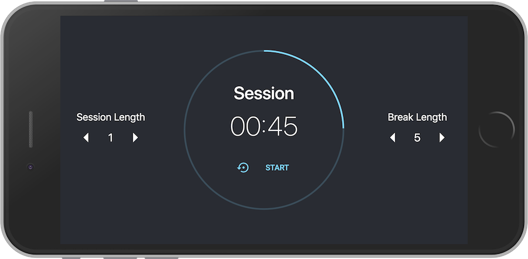

# Pomodoro Timer
[Pomodoro](https://en.wikipedia.org/wiki/Pomodoro_Technique) is a time management strategy in which you use a timer to break down work into intervals, traditionally 25 minutes in length, separated by short breaks.

---

**This project is part of the [FreeCodeCamp](https://www.freecodecamp.org) Front End Libraries Certification**

---

### Branches
- [FCC Project](https://github.com/lukePeavey/pomodoro/tree/fcc-project)
- [Master](https://github.com/lukePeavey/pomodoro)

### Built With
- [CRA](https://facebook.github.io/create-react-app/)
- [React](https://reactjs.org/)
- [Redux](https://redux.js.org/)
- [Jest](https://jestjs.io/)
- [Enzyme](https://airbnb.io/enzyme/)

### Live Demo
[react-pomodoro-timer.surge.sh](http://react-pomodoro-timer.surge.sh)

### Screen Shots

